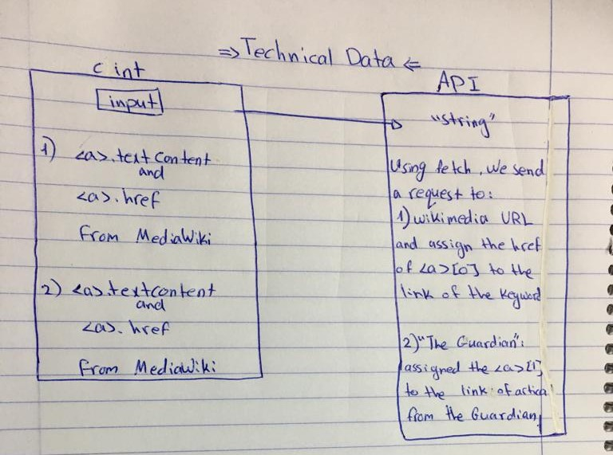

# TechnicalData  :scroll:

memebers of the project :   
1- Hoda @hodamansour   :wink:  
2- Maha @maha276  :wink:  
3- Noor @Noorb7188 :wink:

check out our page [here](https://lotus-1.github.io/TechnicalData/) !  :grin:

Once our client write a word in the search bar,
he recieves 2 results :  :neckbeard:  
1- a link from *MediaWiki* site = using fetch for the url of MediaWiki and assigning the valid URL for the `<a>` href , with adding a `textContent` for it. :milky_way:	  

2- a link form *The Guardian* new site. :milky_way:

we abstracted our code by writing to functions in the DOM.js and called them in our main.js.

- if we had more time to work on the code we would manage the errors more with details
- and the most challenging thing was abstracting the code.
